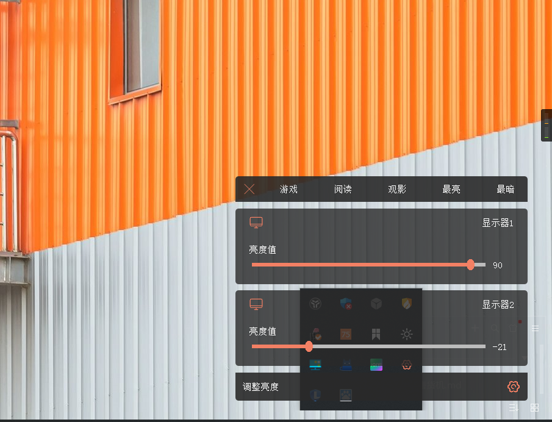
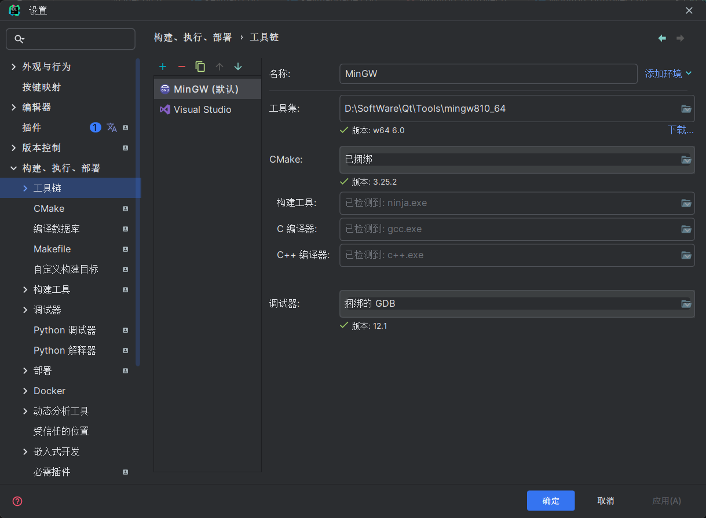
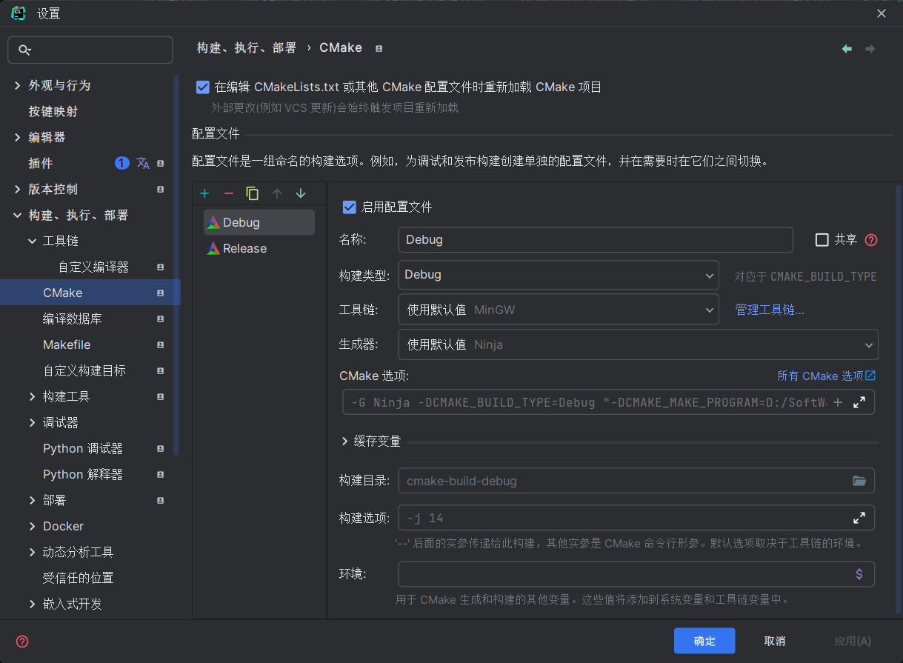
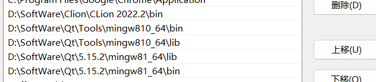
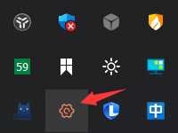
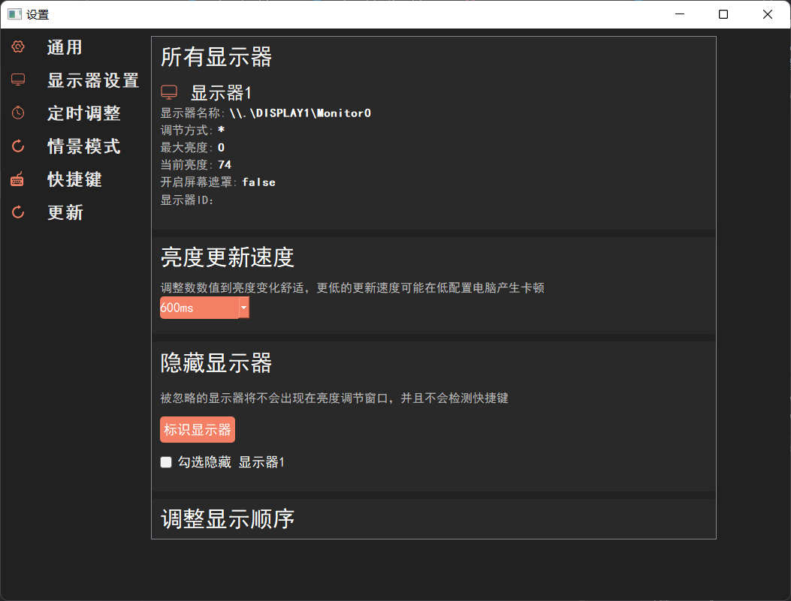
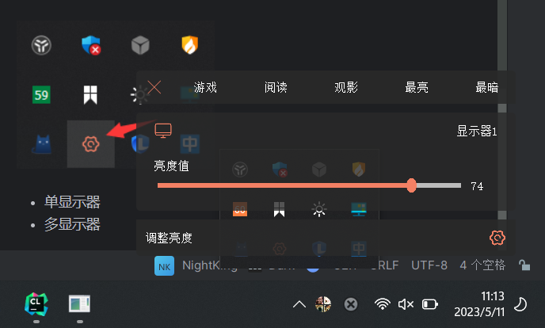
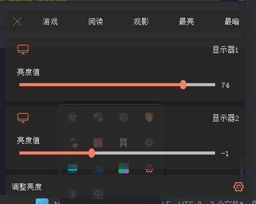

# NightKing 简介

NightKing是一个基于Qt的多显示器亮度调节软件，方便外接显示器进行亮度调节，
更重要的是它能将亮度调节到“负数”既亮度值“小于” 0，
本质上只是在屏幕最上面加了一层遮罩，实现比较简单，
但这对对光线强度较敏感的用户比较有用，因为我就是属于这一类，特别是在夜晚，
显示器的亮度即使调节到最低也还是对眼部很刺激，因此我制作了这个软件
NightKing也能在一定程度上将亮度值调节到100 “以上”，这是利用调节Gama值的方式实现的，
但是由于技术问题，它似乎只在单显示器有效，因此我并未对该功能进行应用，有需要的同学可以自行添加调用下代码即可

效果图：
  

# Demo
尝试下载这个可运行demo来体验一下（debug版本）
https://raw.githubusercontent.com/lixin-hub/NightKing/dev/NightKing.exe

# 进度

- 当前状态 **已暂停**
- 当前进度 **已经完成主要功能**
- 暂停原因 **有其他事情做，后面有必要的话可能会继续完善**

# 运行

1. 克隆代码到Clion 或者QtCreator
2. 配置Qt环境，Cmake环境，配置环境变量（可能要重启电脑）等等，这部分可以参考网上的教程
   
   
   

# 代码质量

- 质量打分 **约等于0**
- 原因 **不会C++，不会Qt，完全是霸王硬上弓**
- 质量这么差为什么还开源 *
  *对windows平台的亮度调节方案做了一定的代码形式总结，网上查了很久，踩了许多坑，虽然本项目代码质量差，但是依然能为初学者甚至一些刚开始了解该领域的牛牛提供一定的帮助，毕竟核心代码大差不差
  **
- 代码 **代码的结构，命名，分包等等都是基于我的java开发经验来的，C++也是刚接触，因此可能不是很符合规范，包括对一些库的调用等等，仅供参考
  **

# 项目结构
````
使用Cmake进行构建，主要使用Clion进行开发，也可以使用QTCreator打开  
├─common 公共代码  
│  ├─monitor 显示器控制相关
│  ├─plans   亮度调节方案  
│  │  ├─DDC_CI  
│  │  ├─Gamma  
│  │  ├─IOCTL  
│  │  ├─Mask  
│  │  └─WMI  
│  └─Util 工具类  
│      ├─AutoBoot  
│      ├─EDIDParser  
│      ├─FileUitl  
│      ├─JsonUtil
│      ├─KeyMapUtil
│      └─TimeUtil
├─component 组件
│  ├─DisplayOrder 显示器顺序
│  ├─keymap  快捷键
│  ├─MarkDisplay 标记显示器
│  ├─MonitorInfo 显示器信息
│  ├─myprogressbar 亮度调节进度条
│  ├─popwindow  弹窗
│  └─TimerPoint 时间点
├─doc
├─img 图片资源
├─lib dll
├─page 设置页面文件
│  ├─dispaly 显示设置
│  ├─genarate 通用设置
│  ├─keymap 快捷键
│  ├─sence 情景模式
│  └─time 定时任务
├─qtservice  这个是一个开源项目，实现后台运行的，暂时没使用
│  ├─buildlib
│  ├─doc
│  │  ├─html
│  │  │  └─images
│  │  └─images
│  ├─examples
│  │  ├─controller
│  │  ├─interactive
│  │  └─server
│  └─src
└─settingwindow 设置主界面
````
# 运行截图

- 托盘图标  
  
- 设置
- 快捷键
  默认设置了ctrl+w 和ctrl+q,进行亮度加减，设置页面的快捷键并没有实现输入绑定，有需要的可以自行实现，
  
- 单显示器                                                  
  
- 多显示器
  
# 最后
如果本项目对您有帮助别忘了点个star支持一下，谢谢。
